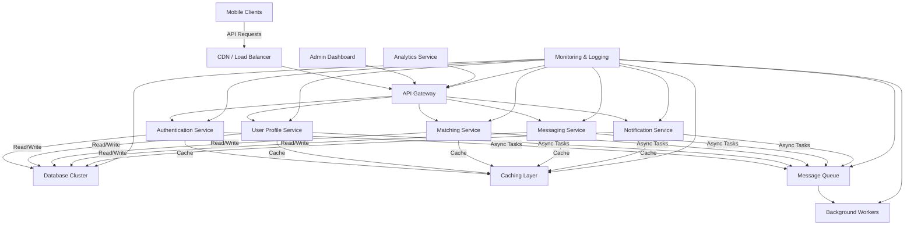
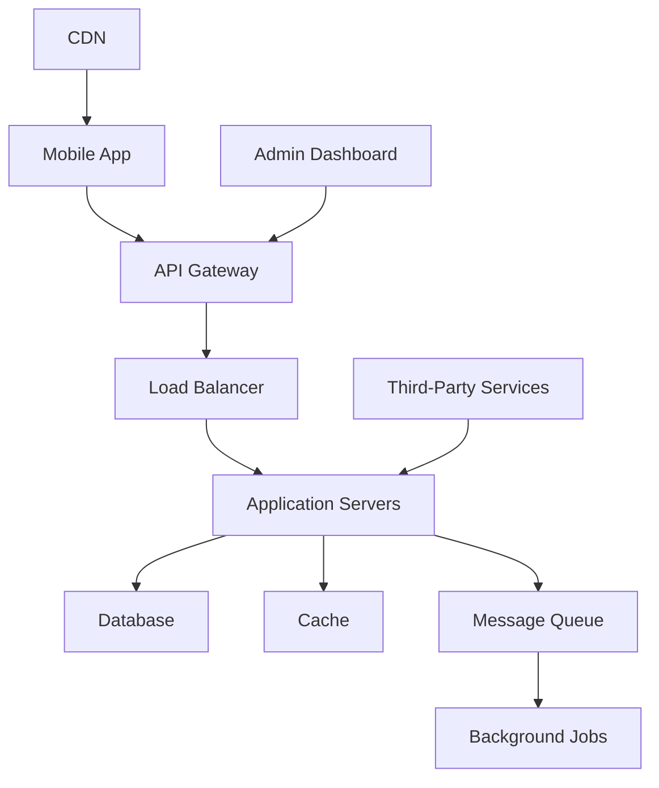

# Dynamic Question Assignment Dashboard

This project is a dynamic question assignment dashboard built with NestJS for the backend and React for the frontend. It allows users to create, manage, and view question assignments based on different regions.

## Table of Contents

- [Installation](#installation)
- [Usage](#usage)
- [API Endpoints](#api-endpoints)
- [Contributing](#contributing)
- [License](#license)

## Installation

1. Clone the repository:
   ```bash
   git clone https://github.com/yourusername/your-repo-name.git
   cd your-repo-name
   ```

2. Install the dependencies for the backend:
   ```bash
   cd backend
   npm install
   ```

3. Install the dependencies for the frontend:
   ```bash
   cd frontend
   npm install
   ```

4. Set up your environment variables. Create a `.env` file in the backend directory and configure your MongoDB connection string and other necessary variables.

5. **Run MongoDB using Docker**:
   To set up a MongoDB instance, you can use Docker. Run the following command:
   ```bash
   docker-compose up -d
   ```
   After executing `docker-compose up -d`, you will have a running MongoDB instance accessible at `localhost:27017` on your host machine, with the ability to persist data through the `mongodb_data` volume. You can connect to MongoDB using a client (like MongoDB Compass or a shell) with the specified credentials (root / example_password).

6. **Seed Initial Data**:
   To populate the database with initial data, you can run the seed script. Navigate to the backend directory and execute:
   ```bash
   ts-node src/scripts/seed.ts
   ```
   This script will check if there are existing questions in the database and, if not, will insert sample questions for different regions.

## Usage

1. Start the backend server:
   ```bash
   cd backend
   npm run start
   ```

2. Start the frontend application:
   ```bash
   cd frontend
   npm start
   ```

3. Open your browser and navigate to `http://localhost:3000` to view the dashboard.

## API Endpoints

### Question Assignments

- **GET** `/question-assignments/current-assignments` - Get current question assignments for all regions.
- **GET** `/question-assignments/upcoming-assignments` - Get upcoming question assignments.
- **POST** `/question-assignments/create` - Create a new question assignment.

### Questions

- **GET** `/questions` - Get all questions.
- **POST** `/questions` - Create a new question.

## Contributing

Contributions are welcome! Please open an issue or submit a pull request for any improvements or bug fixes.


High-Level System Architecture for a Scalable Application

To design a scalable social application capable of handling 100,000 daily active users (DAU) and scaling to support millions of global users, we need to consider several key components and best practices. Below is a high-level system architecture diagram along with an explanation of each component tailored for a mobile-centric application.
## Architecture Diagram




## Simplified Architecture Diagram

## Key Components

### 1. Mobile Clients
- Native mobile apps for iOS and Android
- Optimized for performance and user experience
- Efficient data synchronization and offline capabilities

### 2. CDN / Load Balancer
- Content Delivery Network for global static asset serving
- Load balancer for traffic distribution and high availability

### 3. API Gateway
- Single entry point for all client requests
- Handles routing, rate limiting, and basic request validation
- API versioning support

### 4. Microservices

#### a. Authentication Service
- User registration, login, and token management
- Secure authentication methods (OAuth, JWT) and social login integrations

#### b. User Profile Service
- Manages user profiles, preferences, and settings
- Handles profile picture uploads and processing

#### c. Matching Service
- Implements matching algorithms based on user preferences, location, and behavior
- Machine learning models for improving match quality

#### d. Messaging Service
- Real-time and asynchronous messaging between users
- Message encryption for privacy and security

#### e. Notification Service
- Push notifications, in-app notifications, and email notifications
- User notification preferences and delivery rules

### 5. Cache Layer (Redis)
- Caches frequently accessed data (user profiles, matches, messaging threads)
- Distributed caching for scalability and fault tolerance

### 6. Message Queue (Kafka)
- Handles asynchronous tasks and inter-service communication
- Enables event-driven architecture for real-time updates

### 7. Database Layer
- Primary Database Cluster: Distributed NoSQL database (e.g., Cassandra, MongoDB)
- Read Replicas: For offloading read operations and improving performance

### 8. Analytics Service
- Processes user behavior data for improving algorithms and features
- Generates reports and insights for business intelligence

### 9. Background Jobs
- Scheduled tasks (daily match recommendations, inactive user reminders)
- Long-running tasks processing

### 10. Admin Dashboard
- Web-based interface for customer support and content moderation
- User management and app analytics access

### 11. Monitoring & Logging
- Comprehensive logging and monitoring (ELK stack, Prometheus)
- System health and performance alerts

### 12. Location Services
- Integration with mapping APIs for location-based features
- Geohashing for efficient proximity searches

## Key Considerations

1. **Scalability**: Horizontal scaling, auto-scaling groups
2. **Real-time Performance**: Low-latency interactions, WebSockets
3. **Data Privacy and Security**: End-to-end encryption, regulatory compliance
4. **Location-based Services**: Efficient geospatial data handling
5. **Mobile Optimization**: Data synchronization, compression techniques
6. **User Engagement**: Smart notifications, personalized experiences
7. **Content Moderation**: Automated systems, user reporting tools
8. **Fault Tolerance**: Graceful degradation, circuit breakers

This architecture provides a solid foundation for a scalable, performant, and feature-rich social application, designed to handle millions of users while ensuring real-time interactions, data privacy, and an engaging user experience on mobile devices.


## Stretegy Overview

In the current implementation, the system is designed as a read-heavy architecture, where questions are assigned regionally and handled through a queue-based mechanism. The core idea is to ensure that each region consistently displays the correct question at any given time based on predefined start dates and durations. Below is a detailed explanation of the strategy

## Key Components

1. **Region-Specific Question Queues**: Each region has its own queue of upcoming questions.
2. **CRON Service**: Manages question activation and deactivation based on predefined schedules.
3. **Active Question Management**: Tracks the currently active question for each region.

## Implementation Details

1. **Question Addition**:
   - New questions are added to the region-specific "upcoming questions" queue.
   - Each question is associated with metadata: region, start date, and duration.

2. **Question Activation**:
   - The CRON service regularly checks the start date and duration of questions in each region's queue.
   - When a question's start date arrives, it becomes the active question for that region.

3. **Question Rotation**:
   - Once a question's duration expires, its active state is set to false.
   - The next question from the region's queue becomes active.

4. **Continuous Monitoring**:
   - The CRON service performs daily checks on each question's start and end dates (start date + duration).
   - It updates the question display accordingly, ensuring timely content rotation.

## Pros

1. **Optimized for Read-Heavy Systems**: Reduces database queries by using queues and scheduled checks.
2. **Region-Specific Content**: Allows for tailored question assignments per region.
3. **Automated Management**: CRON service handles question rotations without manual intervention.
4. **Scalability**: Can easily accommodate multiple regions and a large volume of questions.
5. **Predictable Content Rotation**: Questions change at predetermined times, ensuring consistency.
6. **Efficiency**: Minimizes database load for frequent question retrievals.
7. **Flexibility**: Easily adaptable to different time zones and regional content requirements.

## Cons

1. **Dependency on CRON Service**: System relies heavily on the CRON service; any issues could disrupt question rotations.
2. **Potential for Missed Updates**: If the CRON service fails, questions might not update on time.
3. **Limited Flexibility**: Difficult to make immediate changes to question schedules once they're in the queue.
4. **Memory Usage**: Storing upcoming questions in queues could be memory-intensive for a large number of regions or questions.
5. **Complexity**: The system may be more complex to maintain compared to a simpler, on-demand question fetching approach.
6. **Limited Real-Time Flexibility**: Changes to active questions require waiting for the next CRON cycle or manual intervention.
7. **Resource Intensive**: Regular CRON jobs checking all regions might be resource-intensive as the system scales.

## Future Improvements

1. Implement a caching layer to further reduce database load.
2. Add redundancy to the CRON service to improve reliability.
3. Develop a mechanism for real-time updates to question schedules.
4. Optimize queue management for more efficient memory usage.
5. Implement monitoring and alerts for system health and performance.
6. Develop a more sophisticated scheduling algorithm to handle peak usage times in different regions.
7. Introduce real-time updates for immediate question changes when necessary.
8. Implement a fallback mechanism to ensure content delivery in case of CRON service failure.

As of now this strategy provides a robust foundation for managing region-specific, time-based question assignments in a read-heavy system. It offers efficient content delivery and automated management while presenting opportunities for further optimization and scaling as the application grows.